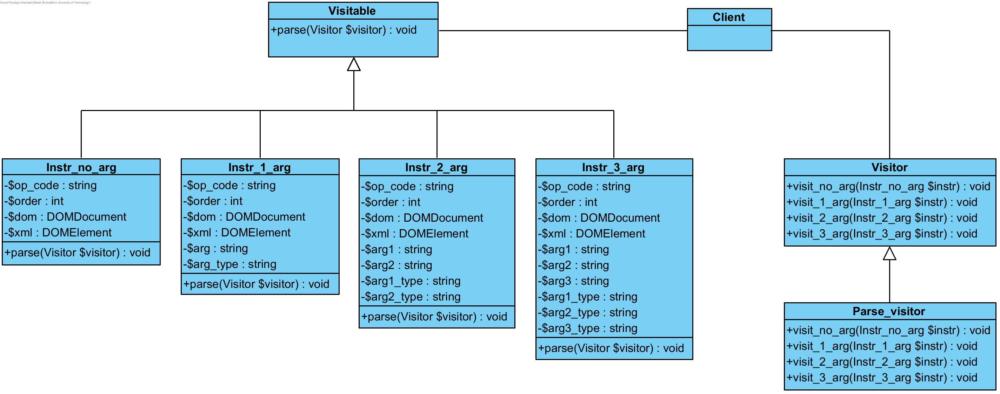

# Implementační dokumentace k 1. úloze do IPP 2022/2023
Jméno a příjmení: Matúš Ďurica
<br>
Login: xduric06

## Parse.php implementation details
Script is divided into multiple source files, which contain definitions of various functions (most importantly ```parse_src_file()```), interfaces and classes. Main file ```parse.php``` checks command-line arguments and either displays help to ```stdout``` if ```--help``` argument was used or calls the aforementioned function ```parse_src_file()``` to parse the source IPPcode23 code if no arguments were inputted. Combination of ```--help``` argument and source code on ```stdin``` displays help and exits with code 0. Unknown arguments or incorrect amount of arguments lead to error code 10.
<br>

### OOP implementation (NVP extension)
I decided to use OOP for this part of the project. I used Visitor pattern, because I felt, it suited this project really well. Details of my implementation of the Visitor pattern can be seen in the diagram below.

Visitor pattern allows adding new functions without needing to modify the classes (e.g., implementing another ```Visitor``` sub-class  which would parse into different language). Visitor pattern also allows programmers to follow open/closed principle (open for extension, closed for modification). This leads to easily extensible and reusable code.
<br>

### Working principle of the script
Script utilizes one cycle to check the whole source code file. First thing being checked is the header ```.IPPcode23```. Only after ```header_flag``` variable is set to true, script continues with parsing the rest of the file. Missing header or incorrect header leads to error code 21.
<br>

Checking instructions is done using switch statement, where unknown instructions lead to error code 22. Arguments are checked using ```check_var()```, ```check_label()``` and ```check_symb()``` functions. All of them utilize regular expressions to check arguments of the instructions. Incorrect argument leads to error code 23.
<br>

After IPPcode23 instruction is checked for its arguments using functions descibed above, ```Visitable``` object (depending on number of arguments) is created and then ```parse()``` function is called. This function then calls ```visit_no_arg()```, ```visit_1_arg()```, ```visit_2_arg()``` or ```visit_3_arg()``` depending on the ```Visitable``` object from which it was called, which generates XML with the data of the arguments to ```stdout```.